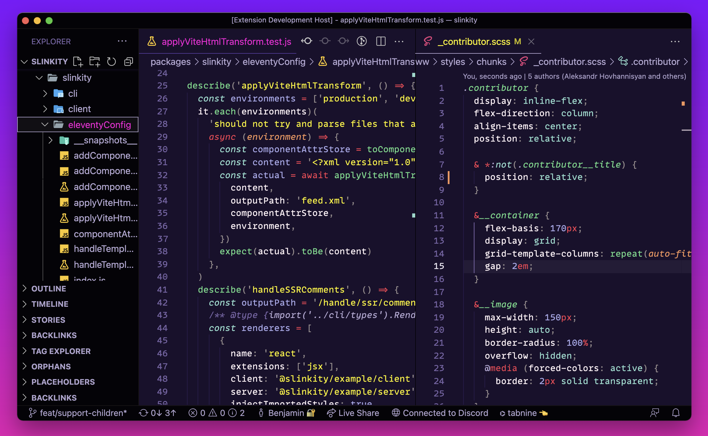

# 😎 Welcome to slinkwave 😎

A VS Code theme built for the cyber space. These colors are based on the incredible Monokai Pro theme, fine-tuned to mirror the deep purples and bright neons of Synthwave '84.

Like what you see? Support the [Slinkity](https://slinkity.dev/) open source project for more web tooling and more retro aesthetic 😎

### For more information
* [Contribute to our slinkwave themes](https://github.com/slinkity/slinkwave-themes)
* [Contribute to Slinkity](https://github.com/slinkity/slinkity)

**Enjoy!**
